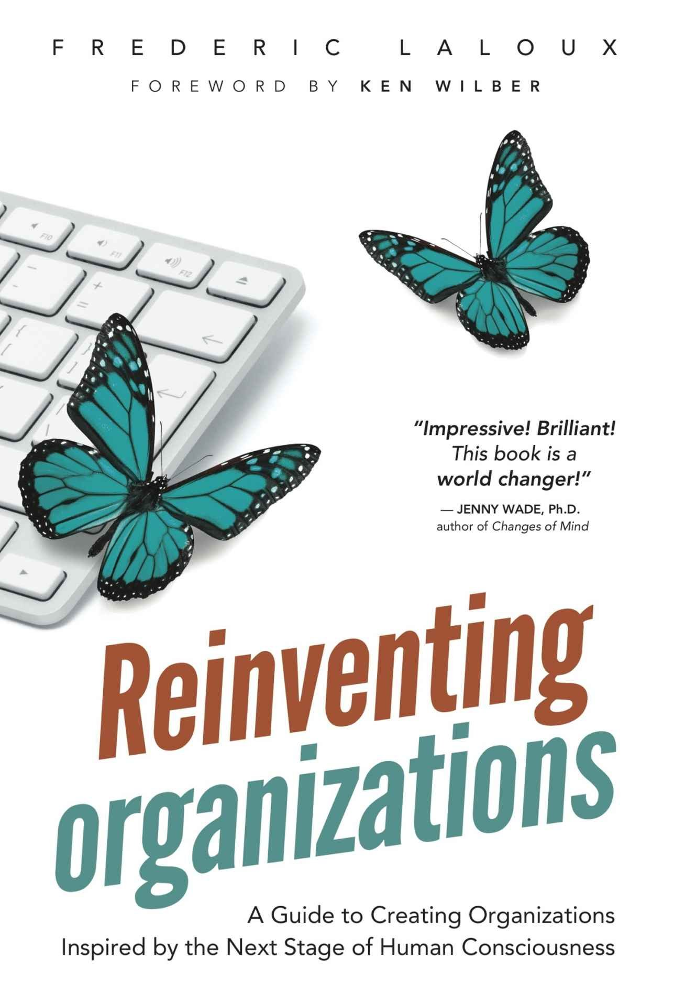

# Reinventando Organizações
## Do controle à autonomia

---

Guilherme Rodrigues

guilherme@vtex.com

---

---

> Zappos CEO Tony Hsieh: Adopt Holacracy Or Leave
-- Fast Company, Março 2015

---

---

## Um novo paradigma de
# organização

#### A forma como trabalhamos agora não é a única forma

---

### Pesquisas apontam
### (e nós sentimos) uma
# [fit] crise do trabalho

---

## Alguns números representativos

#### agregados pela officevibe.com

---

> 88% dos funcionários não têm paixão pelo seu trabalho.

---

### Desmotivação não está somente
### na base da pirâmide

---

> Apenas 20% dos gerentes sênior têm paixão pelo seu trabalho.

---

### Está (cada vez mais) difícil para empresas
### contratar e manter talento

---

> 79% sentem problemas significativos de retenção e engajamento de funcionários.

---

> Apenas 17% sentem que têm uma "employer branding" atraente e cativante.

---

### E agora? O que fazemos? Desistimos?

---

> Permaneça incondicionalmente construtivo
-- Meu pai ®

---

# Uma nova esperança

#### Algumas empresas estão mostrando um novo caminho

---

## Para evoluir é necessário estar disposto a
# questionar

---

> "Se todos têm que pensar fora da caixa, talvez seja a caixa que precise de conserto."
-- Malcolm Gladwell

---

## Caixa = Paradigma
## Nosso "normal"

---

# Quebra de paradigmas
## não é nada novo

---

# Quebra de paradigmas
## cada vez mais rápida

---

#### Sociedade agrária para industrial

# Renascimento

### 🇵🇱 Copernicus 🇮🇹 Galileo 🇬🇧 Bacon
## 🌎 Método Científico 🌞

---

#### Sociedade industrial para informacional

# Internet
## 🌎 Globalização
## 📱 Mobilidade

---

### Humanidade regularmente dá
# saltos de consciência

### Impossível passa a ser normal

---

# Fases das organizações

### e seus avanços

---

#### Sociedade tribal

# Vermelho

### Divisão de trabalho
### Autoridade de comando

---

#### Sociedade agrária

# Âmbar

### Hierarquia estável
### Processos

---

#### Sociedade industrial

# Laranja

### Inovação
### Meritocracia

---

#### Sociedade informacional

# Verde

### Empoderamento
### Valores

---

## Modelos baseados em
# hierarquia

---

## Modelos baseados em
# controle

---

## Centralização não é
# escalável

---

### Sistemas simples como a hierarquia são
### incapazes de processar a crescente

## complexidade do mundo

---

# Sistemas Complexos

### Altamente robustos

---

# Sistemas Complexos

### Baseados em regras simples

---

# Sistemas Complexos

### Inerentemente distribuídos

---

# Teal

---

> Auto-gerenciamento

---

> Plenitude

---

> Propósito evolucionário

---

## Exemplos reais
## Resultados incríveis

---

- AES: Setor de Energia – Global – 40.000 funcionários – fins lucrativos

- Buurtzorg: Assistência Médica – Holanda – 7.000 funcionários – sem fins lucrativos.

- ESBZ: Escola (Classes 7-12) – Alemanha – 1.500 alunos, equipe e pais – sem fins lucrativos.

---

- FAVI: Produtos de metal – França – 500 funcionários – fins lucrativos.

- Heiligenfeld: Hospitais de saúde mental – Alemanha – 600 funcionários – fins lucrativos.

- Morning Star: Fabricação de Alimentos – Estados Unidos – 400-2.400 funcionários – fins lucrativos.

---

- Patagonia: Vestuário– Estados Unidos – 1.350 funcionários – fins lucrativos.

- Resources for Human Development (RHD): Serviços Humanos – Estados Unidos – 4.000 funcionários – sem fins lucrativos.

- Sounds True: Mídia – Estados Unidos – 90 funcionários e 20 cães – fins lucrativos.

---

- Sun Hydraulics: Componentes Hidráulicos – Global – 900 funcionários – fins lucrativos.

- Holacracy: Modelo de operação de organização - um sistema de gestão adotado por algumas centenas de organizações com e sem fins lucrativos em todo o mundo, mais conhecida pela adoção da Zappos.

---

# Holacracia

### Sistema operacional para organizações

---

---

> Autoridade distribuída

---

> Papéis ao invés de descrições de cargo

---

> Iterações rápidas
ao invés de re-orgs

---

> Regras transparentes

---

# A mudança é inevitável

#### Empresas hierárquicas não serão capazes de lidar com os desafios do mundo globalizado

---

> Perguntas?

---

# Obrigado!  
#### Confira a palestra do Frederic Laloux:
### http://tiny.cc/reinventing
